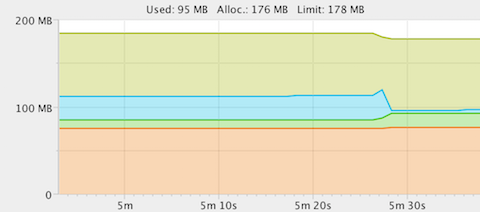
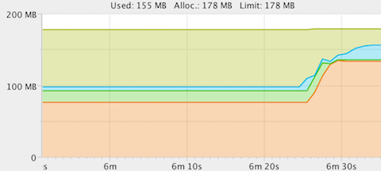

# Repro steps for ARTEMIS-1559

This issue has been reported to upstream repository:
[ARTEMIS-1559](https://issues.apache.org/jira/browse/ARTEMIS-1559)

Start up the server:

```bash
$ ../../../gradlew run
```

Then, verify that you can connect to the RPC server with the correct port (non-TLS):

```bash
$ ../../../gradlew run -Pmode=good-client
```

Use a tool such as [YourKit Profiler](https://www.yourkit.com/java/profiler/download/)
to keep an eye on the memory profile.



Then, try to establish an RPC connection to the P2P target (which expects TLS traffic):

```bash
$ ../../../gradlew run -Pmode=bad-client
```



Note that the heap usage grows rapidly (and eventually causes an out-of-memory
exception if `-Xmx` is set too low). All the allocations seem to be claimable, so
they get picked up in the next GC sweep.

The connections are obviously rejected, but the connection attempts seem quite costly
memory-wise.